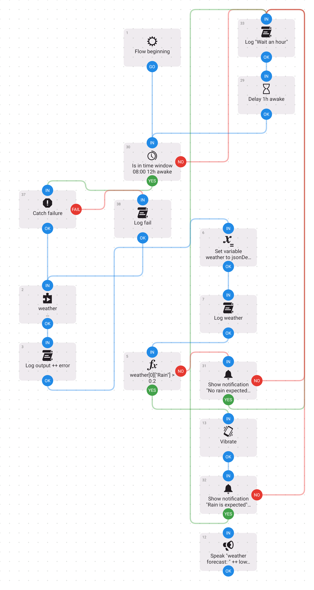
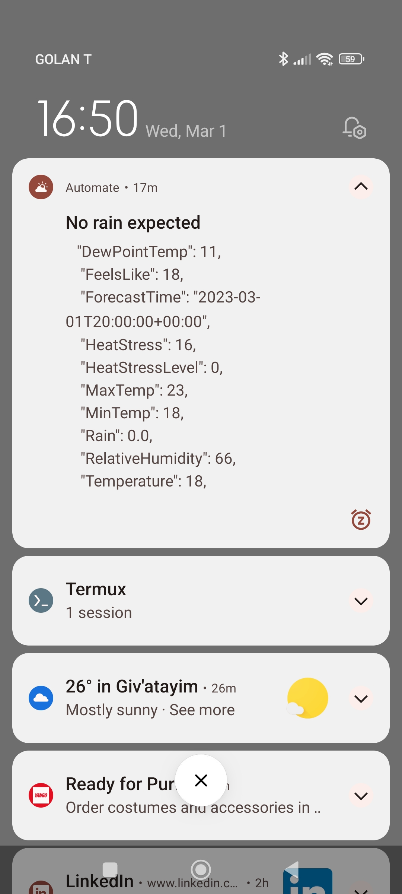

# israel-weather-rs
[](https://github.com/barakplasma/israel-weather-rs/actions/workflows/periodic_test.yml)
[](https://github.com/barakplasma/israel-weather-rs/actions/workflows/release.yml)
[](https://github.com/barakplasma/israel-weather-rs/actions/workflows/cross-compile.yml)
[](https://github.com/barakplasma/israel-weather-rs/actions/workflows/test.yml)


gets weather forecast xml from ims.gov.il and parses it into rust structs

Runs on my android phone to alert me when it's likely to rain in the next 6 hours via an integration with https://llamalab.com/automate/. Could also be setup to alert you or run on linux/mac/windows/raspberry pi with another notification wrapper like https://github.com/nikoksr/notify or https://github.com/caronc/apprise

## Help
```
$ weather --help
Downloads and Caches Israeli weather forecast from https://ims.gov.il and prints the next forecast for a location as json

Usage: weather [OPTIONS]

Options:
  -l, --location <LOCATION>  Location to check weather for [default: "Tel Aviv - Yafo"]
  -n, --next <NEXT>          Check next n hours ahead [default: 6]
  -a, --all                  Ignore location and print all weather data
  -h, --help                 Print help
  -V, --version              Print version
```

## Example output
```json
[
  {
    "DewPointTemp": 21.0,
    "FeelsLike": 25.799999237060547,
    "ForecastTime": "2023-06-26T21:00:00+00:00",
    "HeatStress": 23.899999618530273,
    "HeatStressLevel": 1.0,
    "MaxTemp": 28.0,
    "MinTemp": 26.0,
    "Rain": 0.0,
    "RelativeHumidity": 73.0,
    "Temperature": 25.799999237060547,
    "UvIndex": null,
    "UvIndexMax": null,
    "WeatherCode": 1220,
    "WeatherCodeEnglish": "Partly cloudy",
    "WindChill": 28.0,
    "WindDirection": 270.0,
    "WindSpeed": 5.0
  }
]
```

## Installation
Download from the latest release, or if you need rpi/android from the most recently built cross-compile action

## Get Started with Dev
1. Get rust via rustup
1. cargo run
1. profit

## Running on Android: with help from llamalab automate
I used https://llamalab.com/automate/ [Google Play Store link](https://play.google.com/store/apps/details?id=com.llamalab.automate&referrer=utm_source%3Dhomepage) to run the Android build of this on my android phone on a schedule in order to notify me of expected upcoming rain even when my phone is offline.

I use the [termux/termux-tasker](https://github.com/termux/termux-tasker) [plugin in llamalabs automate](https://llamalab.com/automate/doc/block/plugin_setting.html) to run the latest Android release on a schedule, and to use the Speak and Notifications blocks of Automate.

The [flow file](./barakplasma_israel-weather-rs.flo) can be imported in the Automate app after you setup termux-tasker with it's permissions.




