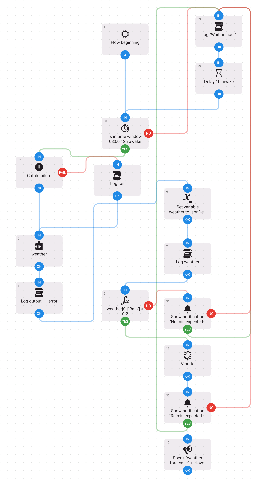
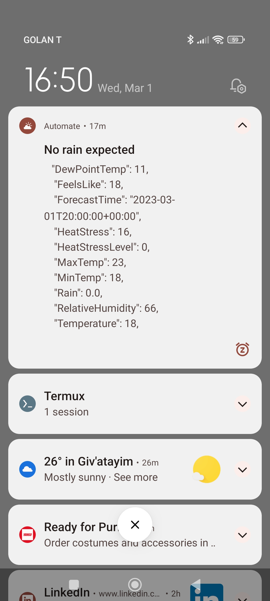

# israel-weather-rs
[](https://github.com/barakplasma/israel-weather-rs/actions/workflows/e2e_test.yml)
[](https://github.com/barakplasma/israel-weather-rs/actions/workflows/cross-compile.yml)
[](https://github.com/barakplasma/israel-weather-rs/actions/workflows/test.yml)
[](https://deepwiki.com/barakplasma/israel-weather-rs)


Fetches weather forecast xml from the Israel Meteorology Service ims.gov.il and parses it into rust structs, which are then printed to stdout as json.

I scheduled the cross-compiled rust binary to run on my android phone with https://llamalab.com/automate/ and Termux. Termux parses the JSON output to alert me when it's likely to rain in the next 6 hours. Whats nice is that the week forecast is cached so that even if i lose network access,i still know if it will rain near me.

Could also be setup to alert you or run on linux/mac/windows/raspberry pi with another notification wrapper like https://github.com/nikoksr/notify or https://github.com/caronc/apprise

## Help
```
$ weather --help
Downloads and Caches Israeli weather forecast from https://ims.gov.il and prints the next forecast for a location as json

Usage: weather [OPTIONS]

Options:
  -l, --location <LOCATION>  Location to check weather for [default: "Tel Aviv - Yafo"]
  -n, --next <NEXT>          Check next n hours ahead [default: 6]
  -a, --all                  Ignore location and print all weather data
  -h, --help                 Print help
  -V, --version              Print version
```

## Example output
```json
[
  {
    "DewPointTemp": 21.0,
    "FeelsLike": 25.799999237060547,
    "ForecastTime": "2023-06-26T21:00:00+00:00",
    "HeatStress": 23.899999618530273,
    "HeatStressLevel": 1.0,
    "MaxTemp": 28.0,
    "MinTemp": 26.0,
    "Rain": 0.0,
    "RelativeHumidity": 73.0,
    "Temperature": 25.799999237060547,
    "UvIndex": null,
    "UvIndexMax": null,
    "WeatherCode": 1220,
    "WeatherCodeEnglish": "Partly cloudy",
    "WindChill": 28.0,
    "WindDirection": 270.0,
    "WindSpeed": 5.0
  }
]
```

## Installation

### Option 1: cargo-binstall (downloads pre-built binary, no compilation)

```sh
cargo binstall israel-weather-rs
```

Install `cargo-binstall` first if you don't have it: `cargo install cargo-binstall`

### Option 2: Download a pre-built binary manually (no Rust required)

Grab the latest binary for your platform from the [releases page](https://github.com/barakplasma/israel-weather-rs/releases):

| Platform | File |
|---|---|
| Linux x86_64 | `weather-x86_64-unknown-linux-gnu` |
| macOS Apple Silicon | `weather-aarch64-apple-darwin` |
| macOS Intel | `weather-x86_64-apple-darwin` |
| Windows | `weather-x86_64-pc-windows-msvc.exe` |
| Android / ARM (Termux) | `weather-aarch64-linux-android` |
| ARM Linux (Pi etc.) | `weather-armv7-unknown-linux-gnueabihf` |

Then make it executable and move it onto your PATH:
```sh
chmod +x weather-*
mv weather-* ~/.local/bin/weather
```

### Option 3: Build and install with Cargo (compiles from source)

```sh
cargo install --git https://github.com/barakplasma/israel-weather-rs
```

The `weather` binary is installed to `~/.cargo/bin/` (make sure that's on your `$PATH`).

### Option 4: Build from source

```sh
git clone https://github.com/barakplasma/israel-weather-rs
cd israel-weather-rs
cargo install --path .
```

## Environment variables

These override compiled-in defaults without requiring a rebuild:

| Variable | Default | Purpose |
|---|---|---|
| `WEATHER_URL` | IMS forecast XML URL | Use a mirror or local file if the IMS URL changes |
| `WEATHER_CACHE_DIR` | system temp dir | Change where the downloaded XML is cached |

Example:
```sh
WEATHER_URL=https://mirror.example.com/forecast.xml weather -l "Haifa"
WEATHER_CACHE_DIR=/var/cache/weather weather --offline
```

## Get Started with Dev
1. Get rust via rustup
1. `cargo run`
1. profit

Also check out the github action. im proud of the CI there.

## Running on Android: with help from llamalab automate
I used https://llamalab.com/automate/ [Google Play Store link](https://play.google.com/store/apps/details?id=com.llamalab.automate&referrer=utm_source%3Dhomepage) to run the Android build of this on my android phone on a schedule in order to notify me of expected upcoming rain even when my phone is offline.

I use the [termux/termux-tasker](https://github.com/termux/termux-tasker) [plugin in llamalabs automate](https://llamalab.com/automate/doc/block/plugin_setting.html) to run the latest Android release on a schedule, and to use the Speak and Notifications blocks of Automate.

The [flow file](./barakplasma_israel-weather-rs.flo) can be imported in the Automate app after you setup termux-tasker with it's permissions.




