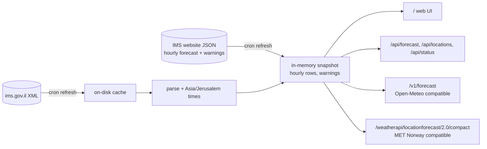
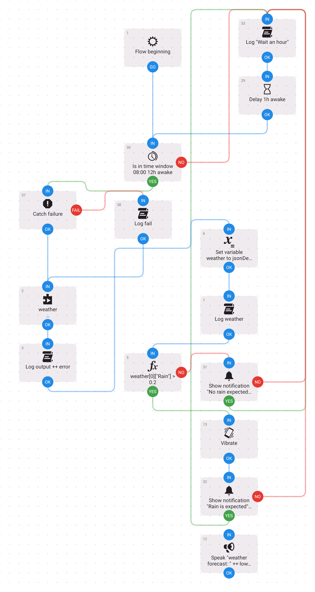
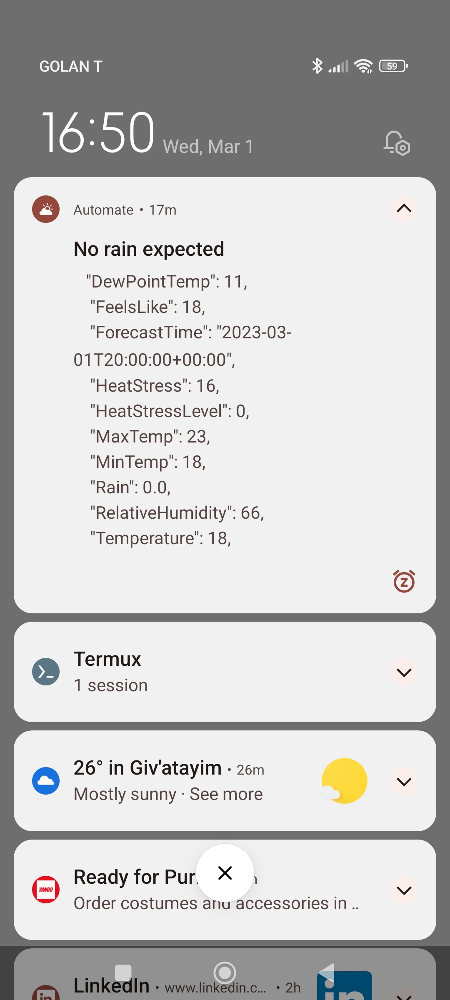

# israel-weather-rs
[](https://github.com/barakplasma/israel-weather-rs/actions/workflows/e2e_test.yml)
[](https://github.com/barakplasma/israel-weather-rs/actions/workflows/cross-compile.yml)
[](https://github.com/barakplasma/israel-weather-rs/actions/workflows/test.yml)
[](https://deepwiki.com/barakplasma/israel-weather-rs)


Fetches weather forecast xml from the Israel Meteorology Service ims.gov.il and parses it into rust structs, which are then printed to stdout as json.

I scheduled the cross-compiled rust binary to run on my android phone with https://llamalab.com/automate/ and Termux. Termux parses the JSON output to alert me when it's likely to rain in the next 6 hours. Whats nice is that the week forecast is cached so that even if i lose network access,i still know if it will rain near me.

Could also be setup to alert you or run on linux/mac/windows/raspberry pi with another notification wrapper like https://github.com/nikoksr/notify or https://github.com/caronc/apprise

## Help
```
$ weather --help
Usage: weather [OPTIONS]

Options:
  -l, --location <LOCATION>  Location to check weather for (case-insensitive) [default: "Tel Aviv Coast"]
  -n, --next <NEXT>          Check next n hours ahead [default: 6]
  -a, --all                  Ignore location and print all weather data
  -o, --offline              Offline mode: only use the previously cached forecast
      --list-locations       List available location names and exit
      --now <NOW>            Pretend the current time is this RFC 3339 timestamp (e.g. 2025-03-08T23:00:00Z)
  -h, --help                 Print help
  -V, --version              Print version
```

Run `weather --list-locations` to see every location name IMS publishes. An unknown `--location` exits non-zero and lists the valid names.

## Example output
`ForecastTime` is Israel local time (`Asia/Jerusalem`) with its UTC offset. `Rain` is in mm.

> **Heads up:** the IMS XML the CLI reads is a *6-hourly sample* of IMS's hourly forecast. Every value, `Rain` included, is for that one hour only (not a 6 hour total), and `MinTemp`/`MaxTemp` are just that hour's rounded temperature. Rain that falls between samples doesn't show up here. `weather serve` uses IMS's hourly data instead (see below).
```json
[
  {
    "ForecastTime": "2026-10-01T03:00:00+03:00",
    "Temperature": 22.6,
    "RelativeHumidity": 70.0,
    "WindSpeed": 5.0,
    "Rain": 0.0,
    "WindDirection": 135.0,
    "DewPointTemp": 17.0,
    "HeatStress": 20.7,
    "HeatStressLevel": 0.0,
    "FeelsLike": 22.6,
    "WindChill": 24.0,
    "WeatherCode": 1230,
    "WeatherCodeEnglish": "Cloudy",
    "MinTemp": 23.0,
    "MaxTemp": 23.0,
    "UvIndex": 0.0,
    "UvIndexMax": 0.0
  }
]
```

## Installation

### Option 1: cargo-binstall (downloads pre-built binary, no compilation)

```sh
cargo binstall israel-weather-rs
```

Install `cargo-binstall` first if you don't have it: `cargo install cargo-binstall`

### Option 2: Download a pre-built binary manually (no Rust required)

Grab the latest binary for your platform from the [releases page](https://github.com/barakplasma/israel-weather-rs/releases):

| Platform | File |
|---|---|
| Linux x86_64 | `weather-x86_64-unknown-linux-gnu` |
| macOS Apple Silicon | `weather-aarch64-apple-darwin` |
| macOS Intel | `weather-x86_64-apple-darwin` |
| Windows | `weather-x86_64-pc-windows-msvc.exe` |
| Android / ARM (Termux) | `weather-aarch64-linux-android` |
| ARM Linux (Pi etc.) | `weather-armv7-unknown-linux-gnueabihf` |

Then make it executable and move it onto your PATH:
```sh
chmod +x weather-*
mv weather-* ~/.local/bin/weather
```

### Option 3: Build and install with Cargo (compiles from source)

```sh
cargo install --git https://github.com/barakplasma/israel-weather-rs
```

The `weather` binary is installed to `~/.cargo/bin/` (make sure that's on your `$PATH`).

### Option 4: Build from source

```sh
git clone https://github.com/barakplasma/israel-weather-rs
cd israel-weather-rs
cargo install --path .
```

## Web server (optional)

Build with the `server` feature to get `weather serve`. It refreshes the IMS forecast on a cron schedule and serves a web UI plus weather APIs that existing clients already speak. Pre-built binaries are published as `weather-server-<target>` on the releases page.

```sh
cargo install --git https://github.com/barakplasma/israel-weather-rs --features server
weather serve --listen 0.0.0.0:8080 --schedule "7 * * * *"
# open http://localhost:8080
```


```mermaid
flowchart LR
  IMS[(ims.gov.il XML)] -->|cron refresh| Cache[on-disk cache]
  Cache --> Parse[parse + Asia/Jerusalem times]
  JSON[(IMS website JSON<br/>hourly forecast + warnings)] -->|cron refresh| Snap
  Parse --> Snap[in-memory snapshot<br/>hourly rows, warnings]
  Snap --> UI["/ web UI"]
  Snap --> Native["/api/forecast, /api/locations, /api/status"]
  Snap --> OM["/v1/forecast<br/>Open-Meteo compatible"]
  Snap --> MET["/weatherapi/locationforecast/2.0/compact<br/>MET Norway compatible"]
```

| Endpoint | Compatible with | Notes |
|---|---|---|
| `/` | | Web UI: search locations, "near me", IMS warnings, 48h chart, hourly forecast by day with rain chance and gusts |
| `/api/forecast?location=Haifa` or `?lat=..&lon=..` | | `hourly` rows from the current hour, IMS `daily` summaries, active `warnings`, `country_forecast` text, plus the raw 6-hourly XML `forecasts`. Optional `hours=` |
| `/api/locations`, `/api/status`, `/healthz` | | Location list, refresh status, health check (503 until data is loaded) |
| `/v1/forecast?latitude=..&longitude=..` | [Open-Meteo](https://open-meteo.com/en/docs) | `hourly`, `daily`, `current`, `current_weather`, `timezone` (`GMT`, `auto`, IANA), `timeformat`, `forecast_days`, `past_days`, temperature/wind/precipitation units |
| `/weatherapi/locationforecast/2.0/compact?lat=..&lon=..` (and `/complete`) | [MET Norway](https://api.met.no/weatherapi/locationforecast/2.0/documentation) | GeoJSON `timeseries` with `instant`, `next_1_hours`, `next_6_hours`, `next_12_hours`. Sends `Last-Modified`/`Expires` |

Data sources, refreshed together on the schedule:

| Source | What it gives | If it fails |
|---|---|---|
| XML `isr_cities_1week_6hr_forecast.xml` (official, ETag-cached, gzip) | locations and a 6-hourly sample of the forecast, ~9 days | previous data is kept |
| `ims.gov.il/en/ims_full_forecast_data` (the IMS website's own JSON) | **real hourly** forecast for 7 days: rain, rain chance, gusts, UV, IMS daily min/max, written country forecast | last good copy (also saved on disk), otherwise XML only |
| `ims.gov.il/en/warnings` (+ `warnings_metadata`, `locations_info`) | IMS warnings (heat, flash floods, high seas, ...) matched to each location's land and sea region, general public only | last good copy |

The website JSON endpoints are undocumented, so parsing is lenient and every part falls back independently. `--ims-json false` turns them off.

How IMS data is adapted:
- Coordinates resolve to the **nearest IMS location**. Requests more than 100 km from any IMS location get a 400.
- Hourly rows come straight from IMS's hourly JSON. Beyond its 7 days, or without it, hours between the 6-hourly XML samples are **linearly interpolated** (rain as an hourly rate), with the weather code from the nearest sample. `/api/forecast` marks each row `"source": "ims"` or `"interpolated"`.
- IMS weather codes are mapped to [WMO codes](https://open-meteo.com/en/docs#weather_variable_documentation) (Open-Meteo) and MET `symbol_code`s, using day/night variants from the sun's position.
- Rain chance and gusts are served as Open-Meteo `precipitation_probability` / `wind_gusts_10m` (and daily maxima) and MET `probability_of_precipitation` / `wind_speed_of_gust`. They're `null`/omitted for interpolated hours.
- Fields IMS doesn't provide (pressure, cloud cover, ...) are omitted. Hours outside the forecast range are `null` in Open-Meteo responses.
- Wind speed from IMS is km/h. MET responses convert it to m/s.

Server settings (flags or env vars):

| Flag | Env | Default |
|---|---|---|
| `--listen` | `WEATHER_LISTEN` | `127.0.0.1:8080` |
| `--schedule` | `WEATHER_SCHEDULE` | `0 7 * * * *` (hourly at :07, Israel time; 5 or 6 field cron) |
| `--offline` | | only use cached copies |
| `--ims-json` | `WEATHER_IMS_JSON` | `true`; `false` = XML only |

`WEATHER_URL`, `WEATHER_IMS_BASE_URL` (default `https://ims.gov.il/en`), `WEATHER_CACHE_DIR` and `RUST_LOG` (default `info` for the server) apply as well. The server shuts down cleanly on SIGTERM, so it works fine as a Kubernetes Deployment with `/healthz` as its probe.

## Environment variables

These override compiled-in defaults without requiring a rebuild:

| Variable | Default | Purpose |
|---|---|---|
| `WEATHER_URL` | IMS forecast XML URL | Use a mirror or local file if the IMS URL changes |
| `WEATHER_CACHE_DIR` | system temp dir | Change where the downloaded XML is cached |
| `RUST_LOG` | `warn` | Log verbosity (JSON logs go to stderr), e.g. `RUST_LOG=trace` |

Example:
```sh
WEATHER_URL=https://mirror.example.com/forecast.xml weather -l "Haifa"
WEATHER_CACHE_DIR=/var/cache/weather weather --offline
```

## Get Started with Dev
1. Get rust via rustup
1. `cargo run`
1. `cargo test --all-features` (offline, uses the bundled `isr_cities_1week_6hr_forecast.xml` fixture)
1. `cargo run --features server -- serve` for the web server
1. `cargo test -- --ignored` (network tests that hit ims.gov.il)
1. profit

Also check out the github action. im proud of the CI there.

## Running on Android: with help from llamalab automate
I used https://llamalab.com/automate/ [Google Play Store link](https://play.google.com/store/apps/details?id=com.llamalab.automate&referrer=utm_source%3Dhomepage) to run the Android build of this on my android phone on a schedule in order to notify me of expected upcoming rain even when my phone is offline.

I use the [termux/termux-tasker](https://github.com/termux/termux-tasker) [plugin in llamalabs automate](https://llamalab.com/automate/doc/block/plugin_setting.html) to run the latest Android release on a schedule, and to use the Speak and Notifications blocks of Automate.

The [flow file](./barakplasma_israel-weather-rs.flo) can be imported in the Automate app after you setup termux-tasker with it's permissions.




